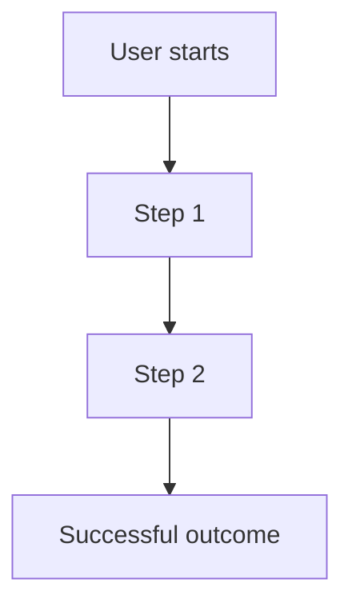

# Product Requirements Template

**File purpose:** use this file as the standard product requirements template for a Technical Product Owner Agent.  
**Primary user:** Technical Product Owner Agent.  
**Output target:** clear product requirements that can be converted into architecture, roadmap, tasks, acceptance criteria and QA checks.  
**Rule:** this document defines what the product must achieve. Implementation details should stay in the technical specification unless they are hard constraints.

---

## 0. Document control

| Field | Value |
|---|---|
| Product name |  |
| Document owner |  |
| Version | 0.1 |
| Status | Draft / Review / Approved / Deprecated |
| Date |  |
| Related technical specification |  |
| Related roadmap |  |
| Related design file |  |
| Related repository |  |
| Decision owner |  |

---

## 1. Product summary

### 1.1 One-line description

> [Describe the product in one sentence.]

### 1.2 Problem

Describe the concrete user, business or operational problem.

Use this format:

- **Who has the problem:**  
- **What happens today:**  
- **Why it matters:**  
- **What breaks if we do nothing:**  

### 1.3 Product goal

State the measurable goal of the product or release.

```text
The goal of this product/release is to [achieve outcome] for [target user] by enabling [capability].
```

### 1.4 Success metrics

| Metric | Target | Measurement method | Owner |
|---|---:|---|---|
|  |  |  |  |

Examples:

- Activation rate
- Task completion rate
- Time saved
- Conversion rate
- Error rate
- Revenue impact
- Manual workload reduction
- Support ticket reduction

---

## 2. Users and stakeholders

### 2.1 Primary users

| Persona | Goal | Pain point | Frequency of use | Priority |
|---|---|---|---|---|
|  |  |  |  |  |

### 2.2 Secondary users

| Persona | Goal | Pain point | Frequency of use | Priority |
|---|---|---|---|---|
|  |  |  |  |  |

### 2.3 Stakeholders

| Stakeholder | Role | Approval needed? | Concern |
|---|---|---:|---|
|  |  | Yes / No |  |

---

## 3. Scope

### 3.1 In scope

List the capabilities that must be delivered.

| ID | Capability | Priority | Notes |
|---|---|---|---|
| PRD-SCOPE-001 |  | Must / Should / Could |  |

### 3.2 Out of scope

List explicitly excluded capabilities.

| ID | Excluded item | Reason | Future consideration |
|---|---|---|---|
| PRD-OOS-001 |  |  |  |

### 3.3 Assumptions

| ID | Assumption | Risk if false | Validation method |
|---|---|---|---|
| PRD-A-001 |  |  |  |

### 3.4 Constraints

| ID | Constraint | Type | Impact |
|---|---|---|---|
| PRD-C-001 |  | Budget / Technical / Legal / Time / UX |  |

### 3.5 Dependencies

| ID | Dependency | Owner | Status | Risk |
|---|---|---|---|---|
| PRD-D-001 |  |  | Unknown / Planned / Ready / Blocked |  |

---

## 4. User journeys and core flows

### 4.1 Main user flow



### 4.2 Alternative flows

| Flow | Trigger | Expected behavior | Edge cases |
|---|---|---|---|
|  |  |  |  |

### 4.3 Failure flows

| Failure case | User sees | System does | Recovery path |
|---|---|---|---|
|  |  |  |  |

---

## 5. Requirements

### 5.1 Functional requirements

Use requirement IDs so every feature can be traced to design, code and tests.

| ID | Requirement | Priority | User value | Acceptance criteria link |
|---|---|---|---|---|
| FR-001 | The system must... | Must / Should / Could |  | AC-001 |

### 5.2 Non-functional requirements

| ID | Category | Requirement | Target | Test method |
|---|---|---|---|---|
| NFR-001 | Performance |  |  |  |
| NFR-002 | Security |  |  |  |
| NFR-003 | Reliability |  |  |  |
| NFR-004 | Usability |  |  |  |
| NFR-005 | Maintainability |  |  |  |
| NFR-006 | Scalability |  |  |  |

### 5.3 UX/UI requirements

| ID | UX/UI requirement | Reason | Acceptance signal |
|---|---|---|---|
| UX-001 |  |  |  |

Include:

- Required screens
- Navigation rules
- Empty states
- Loading states
- Error states
- Responsive behavior
- Accessibility notes
- Design system constraints

### 5.4 Data requirements

| ID | Data object | Fields | Source | Storage | Privacy concern |
|---|---|---|---|---|---|
| DATA-001 |  |  |  |  |  |

### 5.5 Integration requirements

| ID | Integration | Direction | Data exchanged | Failure behavior |
|---|---|---|---|---|
| INT-001 |  | Inbound / Outbound / Bidirectional |  |  |

---

## 6. Product backlog structure

### 6.1 Epics

| Epic ID | Epic name | Goal | Priority | Related requirements |
|---|---|---|---|---|
| EPIC-001 |  |  |  |  |

### 6.2 User stories

Use this format:

```text
As a [persona], I want to [action or goal], so that [benefit].
```

| Story ID | User story | Priority | Epic | Acceptance criteria |
|---|---|---|---|---|
| STORY-001 | As a... | Must / Should / Could | EPIC-001 | AC-001 |

### 6.3 Story slicing guidance

Before sending a story to development, confirm:

- It can be completed in one sprint or one controlled implementation cycle.
- It produces visible user or system value.
- It has testable acceptance criteria.
- It does not hide multiple unrelated features.
- It does not require unresolved product decisions.

---

## 7. MVP and roadmap

### 7.1 MVP definition

The MVP must prove:

- [Core value hypothesis]
- [Core user workflow]
- [Core technical feasibility]
- [Core business or operational metric]

### 7.2 Development phases

| Phase | Goal | Scope | Exit criteria |
|---|---|---|---|
| Phase 0: Discovery |  |  |  |
| Phase 1: Architecture |  |  |  |
| Phase 2: MVP build |  |  |  |
| Phase 3: QA and polish |  |  |  |
| Phase 4: Release |  |  |  |
| Phase 5: Iteration |  |  |  |

### 7.3 Release plan

| Release | Target date | Included epics | Not included | Release risk |
|---|---|---|---|---|
|  |  |  |  |  |

---

## 8. Analytics and feedback

### 8.1 Events to track

| Event name | Trigger | Properties | Purpose |
|---|---|---|---|
|  |  |  |  |

### 8.2 Feedback channels

| Source | What to collect | Review frequency | Owner |
|---|---|---|---|
|  |  |  |  |

---

## 9. Risks and open questions

### 9.1 Product risks

| Risk | Probability | Impact | Mitigation |
|---|---|---|---|
|  | Low / Medium / High | Low / Medium / High |  |

### 9.2 Open questions

| Question | Owner | Decision needed by | Impact if unresolved |
|---|---|---|---|
|  |  |  |  |

---

## 10. Acceptance and release readiness

A release can be accepted only when:

- All Must requirements have acceptance criteria.
- All Must acceptance criteria pass.
- UX/UI review is complete.
- QA review is complete.
- Security and data risks are reviewed.
- Documentation is updated.
- Known bugs are triaged.
- Product owner or Technical Product Owner Agent has accepted the result.

---

## 11. AI Developer Agent handoff

When this PRD is used to brief an AI Developer Agent, provide:

```text
You are AI Developer Agent.

Build only the scope described below.

Product goal:
[Insert product goal]

Feature or epic:
[Insert epic or feature]

Requirements:
[Insert requirement IDs]

Acceptance criteria:
[Insert AC IDs]

Technical constraints:
[Insert constraints]

Out of scope:
[Insert excluded items]

Expected output:
[Code / tests / documentation / explanation / migration / review notes]

Before implementation:
1. Restate the task.
2. Identify assumptions.
3. Identify risks.
4. Propose implementation plan.
5. Wait for Technical Product Owner Agent approval if assumptions are material.
```

---

## 12. Reference basis for this template

This template is inspired by common PRD, SRS and agile requirements practices: PRDs define product capabilities and release completeness; user stories should capture persona, goal and benefit; acceptance criteria make stories testable; requirements should be clear, traceable and testable; Definition of Done creates shared understanding of quality.
