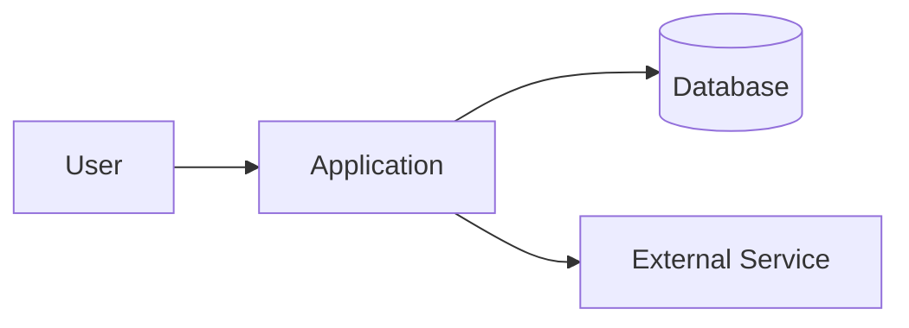
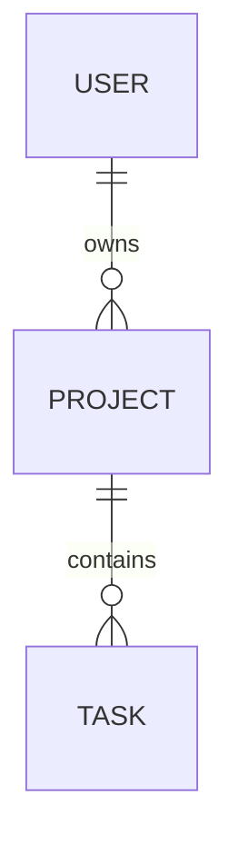

# Technical Specification Template

**File purpose:** use this file to turn product requirements into a clear technical plan for AI Developer Agent execution.  
**Primary user:** Technical Product Owner Agent.  
**Output target:** architecture, modules, interfaces, data model, implementation steps, testing plan and review checklist.  
**Rule:** this document defines how the system should be built. It must trace back to the PRD and acceptance criteria.

---

## 0. Document control

| Field | Value |
|---|---|
| Project / feature |  |
| Technical spec owner |  |
| Product owner |  |
| Version | 0.1 |
| Status | Draft / Review / Approved / Deprecated |
| Date |  |
| Related PRD |  |
| Related acceptance criteria |  |
| Related repository |  |
| Related design file |  |

---

## 1. Executive technical summary

### 1.1 Technical objective

> [Describe what must be built technically and why.]

### 1.2 Linked product requirements

| Requirement ID | Summary | Covered in this spec? | Notes |
|---|---|---:|---|
| FR-001 |  | Yes / No |  |

### 1.3 Non-goals

List what the implementation must not attempt to solve.

| ID | Non-goal | Reason |
|---|---|---|
| NG-001 |  |  |

---

## 2. System context

### 2.1 Context diagram



### 2.2 External systems

| System | Purpose | Data exchanged | Authentication | Risk |
|---|---|---|---|---|
|  |  |  |  |  |

### 2.3 Main technical assumptions

| ID | Assumption | Validation method | Risk if wrong |
|---|---|---|---|
| TS-A-001 |  |  |  |

---

## 3. Architecture

### 3.1 Architecture style

Choose the style and explain the reason.

- Monolith
- Modular monolith
- Microservices
- Serverless
- Event-driven
- Hybrid

Decision:

```text
We will use [architecture style] because [reason].
```

### 3.2 Module map

| Module | Responsibility | Inputs | Outputs | Dependencies | Notes |
|---|---|---|---|---|---|
|  |  |  |  |  |  |

### 3.3 Boundary rules

Define what each module is allowed and not allowed to do.

| Module | Owns | Must not own | Communication rule |
|---|---|---|---|
|  |  |  |  |

### 3.4 Architecture decisions

| Decision ID | Decision | Alternatives considered | Reason | Risk |
|---|---|---|---|---|
| ADR-001 |  |  |  |  |

---

## 4. Data design

### 4.1 Entities

| Entity | Purpose | Key fields | Owner module |
|---|---|---|---|
|  |  |  |  |

### 4.2 Data model



### 4.3 Database changes

| Change | Type | Migration needed? | Rollback plan |
|---|---|---:|---|
|  | Table / Column / Index / Constraint / View | Yes / No |  |

### 4.4 Data validation rules

| Field | Rule | Error message | Test case |
|---|---|---|---|
|  |  |  |  |

### 4.5 Data privacy and retention

| Data type | Sensitivity | Storage rule | Retention rule | Access rule |
|---|---|---|---|---|
|  | Low / Medium / High |  |  |  |

---

## 5. API and interface design

### 5.1 API endpoints

| Method | Path | Purpose | Auth | Request | Response | Errors |
|---|---|---|---|---|---|---|
| GET | /api/... |  |  |  |  |  |

### 5.2 Request and response examples

```json
{
  "example": "value"
}
```

### 5.3 Internal interfaces

| Interface | Producer | Consumer | Contract | Failure handling |
|---|---|---|---|---|
|  |  |  |  |  |

### 5.4 Events and background jobs

| Event / job | Trigger | Payload | Retry rule | Failure alert |
|---|---|---|---|---|
|  |  |  |  |  |

---

## 6. UX/UI implementation notes

### 6.1 Screens and components

| Screen / component | Purpose | States required | Related requirement |
|---|---|---|---|
|  |  | Default / Loading / Empty / Error / Success |  |

### 6.2 Interaction rules

| Interaction | Expected behavior | Edge case |
|---|---|---|
|  |  |  |

### 6.3 Accessibility and responsiveness

Minimum expectations:

- Keyboard navigation works for interactive controls.
- Inputs have labels.
- Errors are understandable.
- Contrast is acceptable.
- Layout works on expected breakpoints.
- Loading and empty states are not dead ends.

---

## 7. Security and permissions

### 7.1 Roles and permissions

| Role | Can do | Cannot do | Notes |
|---|---|---|---|
|  |  |  |  |

### 7.2 Security controls

| Risk | Control | Test |
|---|---|---|
| Unauthorized access |  |  |
| Data leakage |  |  |
| Injection or unsafe input |  |  |
| Broken authorization |  |  |
| Secrets exposure |  |  |

### 7.3 Secrets and configuration

| Config item | Source | Environment | Secret? |
|---|---|---|---|
|  |  | Dev / Staging / Production | Yes / No |

---

## 8. Error handling, logging and observability

### 8.1 Error categories

| Category | User message | Developer log | Retry? |
|---|---|---|---|
| Validation |  |  | No |
| Auth |  |  | No |
| External service failure |  |  | Yes / No |
| Unexpected |  |  | No |

### 8.2 Logging rules

- Log enough context to debug.
- Do not log passwords, tokens, private keys or sensitive personal data.
- Use structured logs where possible.
- Include request IDs or correlation IDs.

### 8.3 Monitoring

| Signal | Threshold | Alert owner | Action |
|---|---|---|---|
| Error rate |  |  |  |
| Latency |  |  |  |
| Failed job count |  |  |  |

---

## 9. Testing strategy

### 9.1 Required test types

| Test type | Required? | Scope | Tool / method |
|---|---:|---|---|
| Unit tests | Yes / No |  |  |
| Integration tests | Yes / No |  |  |
| E2E tests | Yes / No |  |  |
| API tests | Yes / No |  |  |
| Security checks | Yes / No |  |  |
| UX smoke test | Yes / No |  |  |
| Regression tests | Yes / No |  |  |

### 9.2 Acceptance test mapping

| Acceptance criterion | Test case | Automated? | Manual evidence |
|---|---|---:|---|
| AC-001 |  | Yes / No |  |

### 9.3 Test data

| Scenario | Data needed | Source | Reset rule |
|---|---|---|---|
|  |  |  |  |

---

## 10. Implementation plan

### 10.1 Work breakdown

| Task ID | Task | Owner | Dependencies | Acceptance criteria |
|---|---|---|---|---|
| DEV-001 |  | AI Developer Agent |  |  |

### 10.2 Suggested implementation sequence

1. Prepare branch and environment.
2. Implement data model and migrations.
3. Implement backend logic.
4. Implement API contracts.
5. Implement frontend components.
6. Add validation and error states.
7. Add tests.
8. Update documentation.
9. Run review checklist.
10. Submit result for Technical Product Owner Agent review.

### 10.3 Rollout plan

| Step | Action | Owner | Rollback |
|---|---|---|---|
|  |  |  |  |

---

## 11. Technical debt and trade-offs

| Item | Reason accepted | Risk | Follow-up task |
|---|---|---|---|
|  |  |  |  |

---

## 12. AI Developer Agent task prompt

Use this format when sending the technical spec to the AI Developer Agent:

```text
You are AI Developer Agent.

Implement the feature according to this technical specification.

Context:
[Insert technical objective]

Repository / stack:
[Insert stack and repo notes]

Modules affected:
[Insert module list]

Requirements:
[Insert requirement IDs]

Acceptance criteria:
[Insert AC IDs]

Implementation constraints:
[Insert constraints]

Tests required:
[Insert test expectations]

Deliverables:
1. Code changes.
2. Tests.
3. Short implementation summary.
4. Risk notes.
5. Any assumptions or deviations.

Do not change unrelated files.
Do not invent requirements.
Ask for clarification if a missing decision blocks correct implementation.
```

---

## 13. Technical review checklist

Before accepting the implementation, the Technical Product Owner Agent must check:

- Architecture matches this specification.
- Module boundaries are respected.
- Code is readable and maintainable.
- No unrelated changes were introduced.
- Security controls are implemented.
- Required tests exist and pass.
- UX states are implemented.
- Error handling is clear.
- Logs do not expose secrets.
- Documentation is updated.
- Acceptance criteria are demonstrably satisfied.

---

## 14. Open technical questions

| Question | Owner | Needed by | Impact |
|---|---|---|---|
|  |  |  |  |

---

## 15. Reference basis for this template

This template is inspired by SRS and software design documentation practices: clear purpose, scope, users, functional and non-functional requirements, interfaces, traceability, design views, test mapping and approval flow.
